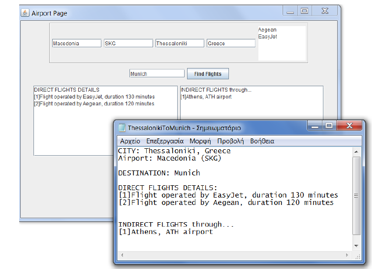

# Airport_Network
Model of an airport network

This project performs a modeling of a simple airport system and the connections of the airports
among them.

Every aiport of this system has a name, a coded name-acronym (3 characters),
the city and the country, where it exists and one list with the airports companies that it serves.

Furthermore, every airport is connected directly with one or more airports from this system (Direct connection).
It can also been connected indirectly with one or more airports which are having only one intermediate airport (Indirect connection).

Moreover, the system preserves a central registry having one list with all the airports and one more with the
itineraries among them.

Every itinenary-flight characterized by two airports, the ones where the daily flights happen.
Additionally, every flight has a specific duration which is related to the aforementioned airports(in minutes)
and the name of the company that it serves.

For this programm it has been used the GUI of Java named "JFrame". 
Specifically, a frame where the user can search an airport exists.
If the aiport that the user entered does not exist,
a message will appear, otherwise a new frame will
open with the information of the specific airport. In the second window, the user can also enter
another aiport and try to find the flights between them.
If these two airports have flights between them, then the information will appear in the frame for
both kind of flights (direct and indirect).

When the user clicks the button "Find flights", in order to find the flights between
these airports, then at the same time a ".txt" file will be created with the information of the flights as it is appeared below.

Finally, with the usage of a external library named "jung2-2_0_1" (exists in the repository), the program has 
the potential to visualize this network.
In the first frame, where the user can search for an airport, he/she can also click another button named "Visualize Network".
By clicking this button, a new frame will open with the airports and the flights visualized as it is appeared below.

In class "Main" some objects have been created and the proper commands are getting perfomed
in order to print results accordingly. 
